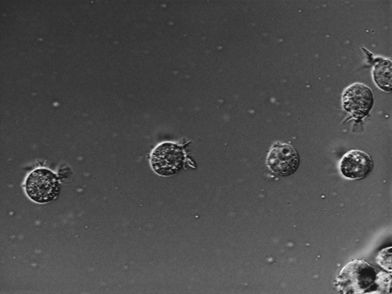

# Games Console Development

This repository contains the code for the Computer Games Console module. Where we had to build a PS3 program which detected regions of interest inside an image.
 
## Assignment

Requirements

## Submission

To build the application copy the following directories to the PS3

* ./assets
* ./common
* ./coursework

After you have do this cd into the coursework directory and use the following commands.

```shell
# Deals with any windows -> linux character encoding problems
dos2unix build.py
# Makes the python script runnable without the python command
chmod +x build.py
# Start the build progress.
./build.py -ppu -spu -o
# Run the app
./app
```

* -ppu = Build the ppu program
* -spu = Build the spu program
* -o   = Build with optimisations.

After the program has run you can find the output of the images located right next to the executable.

## License

Apache 2.0