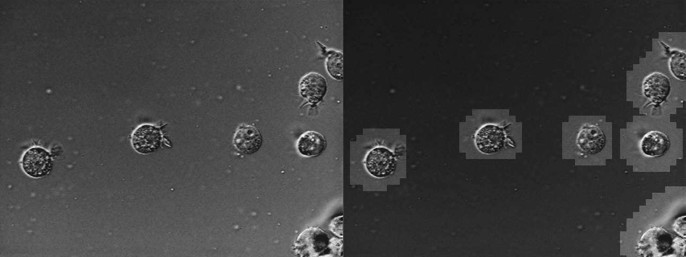

# Games Console Development

The Games Console Development module taught students how to programming the PS3 game console. This module was assessed with both an exam and a practical coursework. The key and interesting part of this module was programming the PS3 as it has a very unique architecture and development environment. This meant returning back to the basics where no IDE was to be found and programs written had to be built from hand calling cli based programs such as Sony's custom GCC compilers as the only way to access the PS3s at the university was by SSH'ing into them. 
 
## Assignment

The assignment was rather complex. We were given a set of PPM files which contained cells in them. We had to write a program that highlighted these cells in the image. We were not allowed to use computer vision libraries and instead had to come up with solutions our self. It was recommended that we wrote an initial implementation on a Windows PC before converting it to run on the PS3. Getting it running on the PS3 was not enough of course, to get extra marks students had to any number of the below requirements. 

**Requirements**

* Use SIMD intrinsics, Multicore decomposition, SPU intercommunication as well as algorithmic optimisation where possible
*  You application components should be developed and tested in phases i.e. Get a C++ version of important ideas working before parallelisation or any other optimisation
*  Each component should be properly tested; with the testing approach and the outcome of testing recorded.
* Decisions about efficient use of SPU local memory management will have to be made consistent with the capabilities of DMA access.
* You are required to provide an appropriate visual representation of the final output from your application.
* Extra marks will be awarded for particularly interesting algorithmic and decomposition approaches provided that they are shown to be practical and viable.

## Submission

As part of the submission an x86 version was written first to have a working approach and to have a traditional version to compare to when it came to the PS3 version. When porting to the PS3 each stage was translated into a separate SPU program to maximize parallelism. Each SPU program then also used SIMD intrinsics to maximize compute power. The complete approach was summed up in a detailed report which was also submitted and the work that was submitted is now being used as an example for future classes to use as a benchmark for what they should submit. 

## License

Apache 2.0